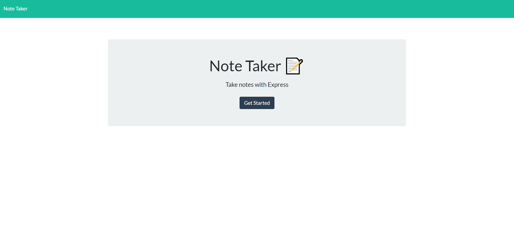
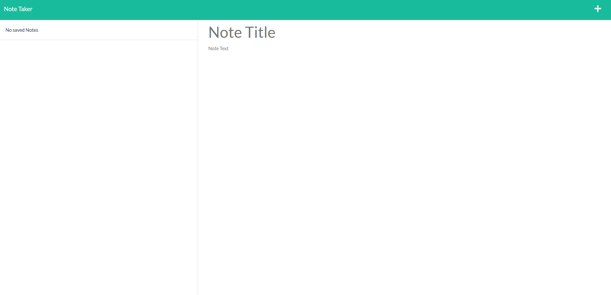

# Note Taker

## Descirption

Using servers this application takes users in between the landing page
and the notes page. When the user gets to the landing page it prompts the
user to select get started. This page is provided by the server. Once they do 
click get started it takes them to the notes page which to is provided by 
server. The user is allowed to enter their notes to the page by clicking the plus
icon and then entering the title and content of the note. Then the user will click the
save icon to add it to the list of notes. The user also may delete their notes by
clicking the trash can icon. All of this interaction is handled by a server and the
data for the notes. 

## Tools
### --This app uses--

* HTML
* CSS
* JavaScript
* Bootstrap
* Express.js

## Screenshots

